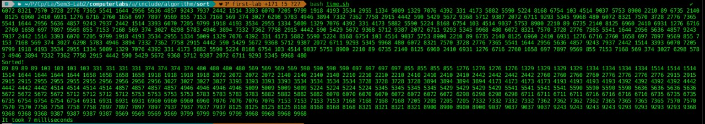

## My bubble-sort on templates with -O3:
HEAP SUMMARY:
==59958==     in use at exit: 0 bytes in 0 blocks
==59958==   total heap usage: 2 allocs, 2 frees, 74,752 bytes allocated

## Quick-Sort on std::vector<> with -O3:
HEAP SUMMARY:
==61585==     in use at exit: 0 bytes in 0 blocks
==61585==   total heap usage: 3 allocs, 3 frees, 76,064 bytes allocated

